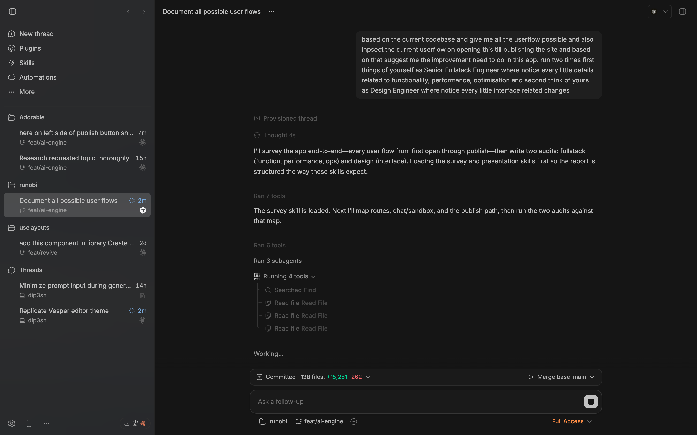
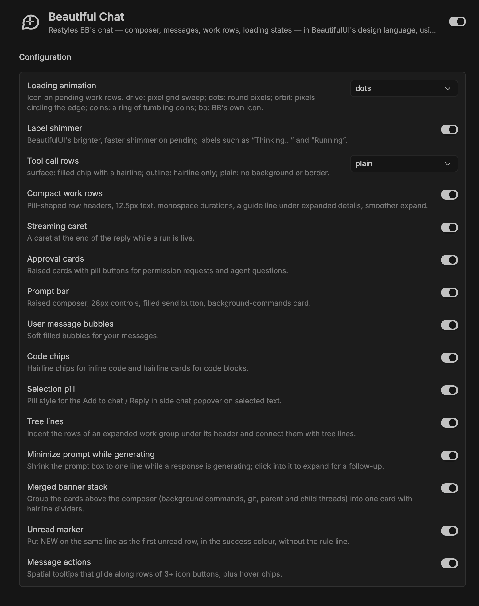

# bb-plugin-beautiful-chat

Restyles BB's native chat — composer, user messages, work rows, tool chips,
approval cards, loading and thinking states — in the design language of
[BeautifulUI](https://www.beautifului.dev) (MIT, © 2026 Shane Levine).

It does not replace BB's chat. It renders an app overlay that injects CSS over
BB's own markup, plus two small DOM behaviours (a spatial tooltip and a CSS
Paint Worklet loader). Geometry, type scale, elevation and motion follow
BeautifulUI; every color is derived from the active BB theme (`--ink`,
`--canvas`, `--foreground`, `--muted-foreground`, `--subtle-foreground`), so it
follows whatever theme you have on rather than imposing its own palette.

No BeautifulUI source code is bundled — only its visual language is applied.

## Screenshots

A running thread: user bubble, the dots loader, tree lines on the live tool group, and the prompt minimized while the response generates.



Every part can be switched off on its own:



## Install

```sh
bb plugin install https://github.com/diip3sh/bb-plugin-beautiful-chat
```

Local development, from the plugin directory:

```sh
bb plugin install path:.
```

Then configure under Settings → Plugins → Beautiful Chat, or with
`bb plugin config beautiful-chat`.

To revert everything: `bb plugin disable beautiful-chat` or
`bb plugin remove beautiful-chat`. Nothing is written to BB's own files.

## Settings

Every feature is independently switchable. Two settings are multi-choice; the
rest are on/off and default to on. Setting ids are the keys below, as declared
in `server.ts`.

| Setting id | Label | Values | What it changes |
| --- | --- | --- | --- |
| `loader` | Loading animation | `drive` (default), `dots`, `orbit`, `coins`, `bb` | The icon on a pending work row. `drive`: a 3×3 pixel grid sweeping; `dots`: the same grid as round pixels; `orbit`: pixels circling the edge; `coins`: a ring of tumbling coins painted by a CSS Paint Worklet; `bb`: leaves BB's own icon alone. |
| `toolChips` | Tool call rows | `surface` (default), `outline`, `plain` | How an individual tool call row is drawn. `surface`: filled chip with a hairline; `outline`: hairline only; `plain`: no background or border. |
| `shimmer` | Label shimmer | on/off | A brighter, faster shimmer band on pending labels such as "Thinking…" and "Running". Only applies under `prefers-reduced-motion: no-preference`. |
| `workRows` | Compact work rows | on/off | Pill-shaped row headers, 12.5px text, monospace durations, a guide line under expanded details, smoother expand. |
| `streamingCaret` | Streaming caret | on/off | A caret at the end of the reply while a run is live and the reply is the latest row. |
| `approvalCard` | Approval cards | on/off | Permission requests and agent questions become raised 10px cards that fade up, with pill decision buttons and hairline radios for question options. |
| `promptBar` | Prompt bar | on/off | Raised composer with a 14px radius and a hairline that firms up on focus, 28px controls, filled send/stop button, background-commands card. |
| `userBubbles` | User message bubbles | on/off | Your messages become soft filled 12px pills with no border. |
| `codeChips` | Code chips | on/off | Inline code as hairline chips, code blocks as hairline cards. |
| `selectionPill` | Selection pill | on/off | Pill style for the "Add to chat / Reply in side chat" popover on selected text. |
| `treeLines` | Tree lines | on/off | Rows inside an expanded work group are indented under its header and joined by a trunk with rounded elbows into each row's icon. |
| `minimizeWhileRunning` | Minimize prompt while generating | on/off | While a run is live and the prompt box is empty, the box collapses to BB's one-line compact layout; typing a follow-up grows it back. |
| `mergedBanners` | Merged banner stack | on/off | The cards above the composer (background commands, git, parent and child threads) are grouped into one card with hairline dividers instead of stacking separately. |
| `unreadMarker` | Unread marker | on/off | The first unread work row prints `NEW` after its own label in the success color, instead of BB's separator and rule above it. Message rows keep BB's separator. |
| `messageActions` | Message actions | on/off | Hover chips on message action buttons, and spatial tooltips: in a row of 3+ tooltip buttons one shared bubble glides and resizes between siblings. Turning this off also unmounts the spatial tooltip script. |

## Source layout

| File | Contributes |
| --- | --- |
| `server.ts` | The plugin server entry. Its only job is `bb.settings.define({...})` — the 15 settings above, with their labels, descriptions, option lists and defaults. |
| `settings.ts` | Pure mapping from setting values to the attributes `app.css` switches on: `LOADERS`, `CHIP_STYLES`, the `TOGGLES` map from setting id to a short off-token, and `rootAttributes()`, which validates untrusted stored values and falls back to the defaults. Unit-tested. |
| `app.tsx` | The app overlay (`app.slots.experimental_appOverlay`). Renders nothing; reads settings with `useSettings()`, writes `data-bui-loader`, `data-bui-chips` and `data-bui-off` onto `<html>`, mounts the spatial tooltips when `messageActions` is on, pins looping animations to the document clock so remounted rows do not jump, and registers the coins worklet when `loader` is `coins`. Removes all attributes on unmount. |
| `phase-sync.ts` | Pins every looping CSS animation to `document.timeline`, so a remounted work row resumes its shimmer and loader instead of restarting from frame 0. |
| `app.css` | All of the styling, ~700 lines, in one section per feature (each section comment names the setting that gates it). Selectors target BB's own markup — `form[data-promptbox]`, `[data-timeline-row-list]`, `section[data-testid="approval-banner"]` and similar. Every rule is scoped by `:root:not([data-bui-off~="<token>"])` or by a `data-bui-loader` / `data-bui-chips` value, so with no attributes set (settings still loading) the defaults apply. Ends with a `prefers-reduced-motion: reduce` block. |
| `spatial-tooltip.ts` | The shared tooltip bubble. Finds the nearest single-row ancestor holding 3+ button items, mirrors Radix's open state, hides the native bubble visually and draws one bubble that moves between siblings. Radix still owns timing, focus, Escape and the screen-reader text. `placeTip()` is exported and unit-tested. |
| `coins-worklet.ts` | The `coins` loader. Registers a CSS Paint Worklet (`bui-coins`) that draws a ring of tumbling coins, driven from CSS by a registered `--bui-coin-t` (0→1) and `--bui-coin-color`. `app.tsx` sets `data-bui-coins-ready` only after registration succeeds; until then (or if Paint Worklets are unavailable) `app.css` keeps showing the `drive` loader rather than a blank icon. |
| `skills/beautiful-chat/SKILL.md` | The agent-facing skill: what the plugin changes and which setting controls each part, so an agent can answer questions about it or adjust settings. |
| `assets/icon.svg` | Plugin branding icon, referenced from `package.json`. |

## Build

```sh
npm install
bb plugin build .
bb plugin reload beautiful-chat
```

`npm run build` runs `tsc --noEmit` first and then `bb plugin build .`.

## Tests

```sh
node --experimental-strip-types --test settings.test.ts spatial-tooltip.test.ts
```

Five tests: `rootAttributes()` value validation and fallbacks, and `placeTip()`
edge-flipping and viewport clamping. No test framework, no browser — both units
are pure functions.

## Limitations

This plugin styles BB's internal DOM. The selectors in `app.css` and the
structure `spatial-tooltip.ts` walks are not a public API, so a BB update can
change the markup they target. When that happens a feature simply stops
applying — the chat keeps working, it just looks like stock BB in that spot —
until the plugin is updated to match. If something looks half-styled after a BB
upgrade, that is the likely cause; turning the relevant setting off is a clean
workaround in the meantime.

## Credits

Design reference: [BeautifulUI](https://www.beautifului.dev) (MIT, © 2026 Shane
Levine). The `coins` loader follows Originkit's Coin Loader. No third-party
source is bundled.
